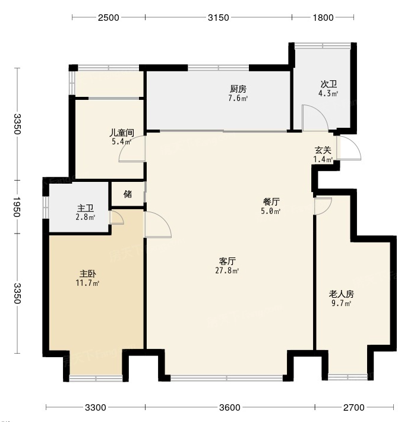
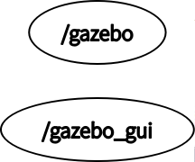
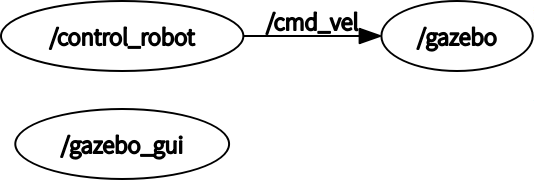
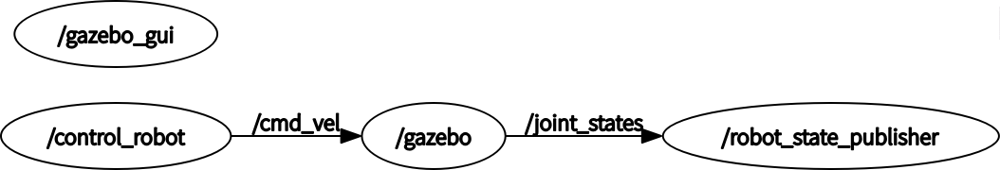
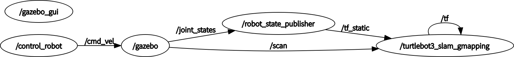
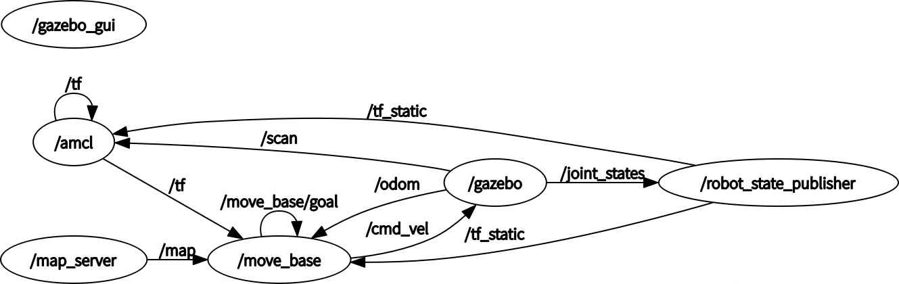

# 基于TurtleBot3的仿真slam建模与导航(Gazebo建模)
## 前言
## 一、TurtleBot3简介
TurtleBot3 是一个小型，低成本，完全可编程，基于 ROS 的移动机器人。它旨在用于教育，研究，产品原型和爱好应用的目的。TurtleBot3 的目标是大幅降低平台的尺寸和价格，而不会牺牲性能，功能和质量。由于提供了其他选项，如底盘，计算机和传感器，TurtleBot3 可以通过各种方式进行定制。TurtleBot3 应用 了SBC（单板计算机），深度传感器和 3D 打印的最新技术进步等技术。
## 二、安装ROS
- 本文使用Ubuntu18.04安装ROS Melodic
### 1  . 更改ROS 源(国内源)
 ``` Shell
    sudo sh -c '. /etc/lsb-release && echo "deb http://mirrors.ustc.edu.cn/ros/ubuntu/ $DISTRIB_CODENAME main" > /etc/apt/sources.list.d/ros-latest.list'
 ``` 
### 2.设置密钥
``` Shell
    sudo apt-key adv --keyserver hkp://keyserver.ubuntu.com:80 --recv-key 421C365BD9FF1F717815A3895523BAEEB01FA116
 ``` 
### 3.更新软件包列表
```Shell
    sudo apt update
```
### 4.安装ROS Melodic
 ```Shell
    sudo apt-get install ros-melodic-desktop-full
 ```

 ### 5.初始化rosdep
 ```Shell
    sudo rosdep init
 ```

 ### 6.更新rosdep
 ```Shell
    sudo rosdep update
 ```

 ### 7.将ros添加到环境变量
 ```Shell
   echo "source /opt/ros/melodic/setup.bash" >> ~/.bashrc source ~/.bashrc
 ```

 ### 8.运行ROS检测是否安装成功
  ```Shell
    roscore
 ```

- 如图所示，这ROS Melodic安装成功
  
  ## 三、安装Turtlebot3
#### 1.安装Turtlebot3依赖库
```Shell
    sudo apt-get install ros-melodic-joy ros-melodic-teleop-twist-joy ros-melodic-teleop-twist-keyboard ros-melodic-laser-proc ros-melodic-rgbd-launch ros-melodic-depthimage-to-laserscan ros-melodic-rosserial-arduino ros-melodic-rosserial-python ros-melodic-rosserial-server ros-melodic-rosserial-client ros-melodic-rosserial-msgs ros-melodic-amcl ros-melodic-map-server ros-melodic-move-base ros-melodic-urdf ros-melodic-xacro  ros-melodic-compressed-image-transport ros-melodic-rqt-image-view ros-melodic-gmapping ros-melodic-navigation  ros-melodic-interactive-markers rviz
```
  #### 2.下载Turtlebot3资源包
  
```Shell
    mkdir -p ~/turtlebot3_ws/src/
    cd ~/turtlebot3_ws/src/
    git clone https://github.com/ROBOTIS-GIT/turtlebot3_simulations.git
    git clone https://github.com/ROBOTIS-GIT/turtlebot3_msgs.git
    git clone https://github.com/ROBOTIS-GIT/turtlebot3.git
```

- git Turtlebot3资源包成功

#### 3.编译Turtlebot3资源包
```Shell
    cd ~/turtlebot3_ws
    catkin_make
```


### 4.测试Turtlebot3是否安装成功
```Shell
    export TURTLEBOT3_MODEL=burger
    source ~/turtlebot3_ws/devel/setup.bash 
    roslaunch turtlebot3_fake turtlebot3_fake.launch
```


### 5.把Turtlebot3加入环境变量
- 打开.bashrc文件
  
```Shell
   gedit ~/.bashrc
```
**将下面两行Shell命令拷贝到文件最后**

```Shell
   export TURTLEBOT3_MODEL=burger
   source ~/turtlebot3_ws/devel/setup.bash 
```

## 四、安装Cartographer
**！！安装Cartographer，需要先升级Cmake**

#### 1、升级Cmake到3.2.0
```Shell
   #先卸载3.10的CMake
   sudo apt remove cmake
   #重新安装依赖
   sudo apt-get install build-essential libssl-dev
   #下载Cmake3.2.0
   wget https://github.com/Kitware/CMake/releases/download/v3.20.0/cmake-3.20.0.tar.gz
   #解压缩
   tar -zxvf cmake-3.20.0.tar.gz
   #运行bootstrap脚本
   cd cmake-3.20.0
   ./bootstrap
   #编译安装
   make 
   sudo make install
```
- 检测Cmake安装是否成功
```Shell
   cmake --version
```

-  安装成功
#### 2、安装Cartographer
**！！按照[Cartographer官网](https://google-cartographer-ros.readthedocs.io/en/latest/index.html#)教程安装**
 - 安装一些工具：wstool, rosdep和Ninja
 ```Shell
  sudo apt-get update
  sudo apt-get install -y python-wstool python-rosdep ninja-build stow
```
- 安装好这些工具后,创建一个cartographer_ros工作区

```Shell
   #创建文件夹
   mkdir carto_ws
   cd carto_ws
   #下载源码
   wstool init src
   wstool merge -t src https://raw.githubusercontent.com/cartographer-project/cartographer_ros/master/cartographer_ros.rosinstall
   wstool update -t src
```
- 更改代码，防止后面报错
**打开cartographer/package.xml将第46行 `<depend>libabsl-dev</depend>` 进行注释**

- 安装依赖项
```Shell
  sudo rosdep init
  rosdep update
  rosdep install --from-paths src --ignore-src --rosdistro=${ROS_DISTRO} -y
```
- 安装abseil-cpp 库
```Shell
  src/cartographer/scripts/install_abseil.sh

   //由于版本冲突，您可能需要卸载ROS abseil-cpp
   sudo apt-get remove ros-${ROS_DISTRO}-abseil-cpp
```
- 编译
```Shell
   catkin_make_isolated --install --use-ninja
```
- 将 cartographer_ws 添加到环境变量中
```Shell
    echo 'source ~/carto_ws/install_isolated/setup.bash' >> ~/.bashrc
   source ~/.bashrc
```
#### 3.官方demo验证
- 2D-Demo与结果
```Shell
   #下载demo包
   wget -P ~/Downloads https://storage.googleapis.com/cartographer-public-data/bags/backpack_2d/cartographer_paper_deutsches_museum.bag
   #测试
   roslaunch cartographer_ros demo_backpack_2d.launch bag_filename:=${HOME}/Downloads/cartographer_paper_deutsches_museum.bag
```


## 五、Gazebo仿真环境搭建
**！！经过测试默认安装的Gazebo9在建立模型放置窗户与门时，会闪退，所以更新为Gazebo11**
```Shell
    # 查看一下Gazebo的插件
   dpkg -l | grep gazebo
   # 卸载全部插件
   sudo apt-get remove gazebo9 gazebo9-common gazebo9-plugin-base libgazebo9:amd64 libgazebo9-dev:amd64 ros-melodic-gazebo-*  
   # 配置镜像
   sudo sh -c 'echo "deb http://packages.osrfoundation.org/gazebo/ubuntu-stable `lsb_release -cs` main" > /etc/apt/sources.list.d/gazebo-stable.list'  
   #查看文件写入是否正确
   cat /etc/apt/sources.list.d/gazebo-stable.list 
   #设置Key
   wget https://packages.osrfoundation.org/gazebo.key -O - | sudo apt-key add - 
   #更新
   sudo apt-get update
   #下载、安装Gazebo 11
   sudo apt-get install gazebo11
   sudo apt-get install libgazebo11-dev
   #安装Gazebo的Ros插件
   sudo apt install ros-melodic-gazebo11-*
   #检查是否安装成功，直接打开Gazebo即可
   gazebo
```


#### 1.打开Gazebo
```Shell
   gazebo
```

#### 2. 打开建筑编辑器
点击上方“Edit”中“Buiding Edit ”进入建筑编辑器。


#### 3.用户型图作为参考
点击左下角“import” ，选择一张户型照片导入。

**户型图如下**


#### 4.创建模型
- 点击左边“ Wall ” ，对着房屋轮廓和内部墙壁描边，下方的3D视图会同步显示墙壁信息。
- 再按照户型图进行门窗的设置，点击左边的“Window ” 和 “ Door ” ，在相应墙壁位置选择即可。
- **可以双击2D视图里的墙壁进行详细参数设置。**
  

#### 5.保存模型
如图，完成模型绘制。

点击左上角“File” → “Save” 保存, 保存为model.config和model.sdf文件。

#### 6.生成.world文件
在gazebo_mode文件中有三个模型，但因为我的电脑性能不行，导入就卡顿，所以用了gazebo的库。

- ganzebo库安装
  
 ```Shell
    # 进入.gazebo文件夹，用于存放Gazebo模型和相关配置文件
   cd ~/.gazebo/
   # 安装Git工具
   sudo apt install git
   # 从https://gitee.com/dva7777/gazebo_models.git克隆Gazebo模型
   git clone https://gitee.com/dva7777/gazebo_models.git
   # 将克隆的gazebo_models文件夹重命名为models，并放到.gazebo文件夹下
   mv gazebo_models/ ./models
  ```

- 放置房间模型
  再次打开gazebo ，左上角insert 选项卡里就会找到自己的模型，找到并选择自己刚
才建好的模型放置到右边窗口。


- 放置部分家具
  在insert选项下，选择添加自己想要的家具等模型，来丰富自己的world。可以通过上方按钮，来平移、旋转模型选择合适的摆放位置。


- 点击“File”中“Save world” ，保存到 .world文件 下，并命名为Myhouse.world。

## 六、配置ROS工作工作空间

#### 1.创建ROS工作空间
```Shell
   #创建文件夹
   mkdir -p ~/roshomework/src
   cd roshomework/src
   # ROS的工作空间初始化命令
   catkin_init_workspace
   cd ..
   # 编译整个工作空间
   catkin_make
   #配置文件中加入环境变量
   echo "source ~/roshomework/devel/setup.bash" >> ~/.bashrc
```

***<font color=red>可以将ros-w的压缩包解压，把所有文件放入oshomework/src中*。省略以下部分至下一章节</font>**

 **在roshomework/src建立三个文件夹，分别为launch、src和worlds。再创建一个包清单的package.xml文件**

```Shell
   touch ~/roshomework/src/package.xml
   mkdir ~/roshomework/src/launch
   mkdir ~/roshomework/src/src
   mkdir ~/roshomework/src/words
```

 #### 2.导入.world文件
 - 创建gazebo_world文件夹

 ```Shell
   mkdir ~/roshomework/src/worlds/gazebo_world
  ```
  - **将第四章-6中生成的Myhouse.world放入gazebo_world文件夹中**
  
  #### 3.编写launch文件
  - 参考turtlebot3_world.launch文件编写
  
  - **新建.launch文件**
```Shell
   touch ~/roshomework/src/launch/ turtlebot3_world.launch
```

  - **将下面程序复制到turtlebot3_world.launch文件中**
```XML
<launch>
  <arg name="model" default="$(env TURTLEBOT3_MODEL)" doc="model type [burger, waffle, waffle_pi]"/>
  <arg name="x_pos" default="0.0"/>
  <arg name="y_pos" default="0.0"/>
  <arg name="z_pos" default="0.0"/>

  <include file="$(find gazebo_ros)/launch/empty_world.launch">
    <arg name="world_name" value="$(find  ros-w)/worlds/gazebo_world/Myhouse.world"/>
    <arg name="paused" value="false"/>
    <arg name="use_sim_time" value="true"/>
    <arg name="gui" value="true"/>
    <arg name="headless" value="false"/>
    <arg name="debug" value="false"/>
  </include>

  <param name="robot_description" command="$(find xacro)/xacro --inorder $(find turtlebot3_description)/urdf/turtlebot3_$(arg model).urdf.xacro" />

  <node pkg="gazebo_ros" type="spawn_model" name="spawn_urdf"  args="-urdf -model turtlebot3_$(arg model) -x $(arg x_pos) -y $(arg y_pos) -z $(arg z_pos) -param robot_description" />
</launch>
```
#### 4. 编写package.xml文件
- **将下列程序复制到package.xml中**

```XML
<?xml version="1.0"?>
<package format="2">
  <name>ros-w</name>
  <version>0.1.0</version>
  <description>zmq wrh homework</description>

  <maintainer email="zhangmingqi318@gmail.com">zmq wrh</maintainer>

  <license>GPL</license>

  <buildtool_depend>catkin</buildtool_depend>
  <build_depend>rospy</build_depend>
  <build_export_depend>rospy</build_export_depend>
  <exec_depend>rospy</exec_depend>
  <exec_depend>gazebo_ros</exec_depend>

  <export>
       <gazebo_ros gazebo_media_path="${prefix}/worlds"/>
  </export>
</package>
```

#### 5.更改Turtlebot3类型
- 打开.bashrc文件
  
```Shell
   gedit ~/.bashrc
```
**将下TURTLEBOT3_MODEL=burger改为export TURTLEBOT3_MODEL=waffle**

```Shell
   #原为burger
   export TURTLEBOT3_MODEL=burger
   #改为waffle
   export TURTLEBOT3_MODEL=waffle
```
#### 6.测试工作空间是否建立

```Shell
roslaunch ros-w turtlebot3_world.launch
```


## 七、程序编写
#### 1、编写键盘控制程序
- 在 ~/roshomework/src/src中创建控制小车的Python的程序（参考turtlebot3_teleop_key程序）

```Shell
   touch ~/roshomework/src/src/rosw_teleop_key.py
```
- 下列代码复制进入.py文件中

 ```Python
#!/usr/bin/env python

import rospy
from geometry_msgs.msg import Twist
import sys, select, os
if os.name == 'nt':
  import msvcrt, time
else:
  import tty, termios

BURGER_MAX_LIN_VEL = 0.22
BURGER_MAX_ANG_VEL = 2.84

WAFFLE_MAX_LIN_VEL = 0.26
WAFFLE_MAX_ANG_VEL = 1.82

LIN_VEL_STEP_SIZE = 0.01
ANG_VEL_STEP_SIZE = 0.1

msg = """
Control Your TurtleBot3!
---------------------------
Moving around:
        w
   a    s    d
        x

w/x : increase/decrease linear velocity (Burger : ~ 0.22, Waffle and Waffle Pi : ~ 0.26)
a/d : increase/decrease angular velocity (Burger : ~ 2.84, Waffle and Waffle Pi : ~ 1.82)

space key, s : force stop

CTRL-C to quit
"""

e = """
Communications Failed
"""

def getKey():
    if os.name == 'nt':
        timeout = 0.1
        startTime = time.time()
        while(1):
            if msvcrt.kbhit():
                if sys.version_info[0] >= 3:
                    return msvcrt.getch().decode()
                else:
                    return msvcrt.getch()
            elif time.time() - startTime > timeout:
                return ''

    tty.setraw(sys.stdin.fileno())
    rlist, _, _ = select.select([sys.stdin], [], [], 0.1)
    if rlist:
        key = sys.stdin.read(1)
    else:
        key = ''

    termios.tcsetattr(sys.stdin, termios.TCSADRAIN, settings)
    return key

def vels(target_linear_vel, target_angular_vel):
    return "currently:\tlinear vel %s\t angular vel %s " % (target_linear_vel,target_angular_vel)

def makeSimpleProfile(output, input, slop):
    if input > output:
        output = min( input, output + slop )
    elif input < output:
        output = max( input, output - slop )
    else:
        output = input

    return output

def constrain(input, low, high):
    if input < low:
      input = low
    elif input > high:
      input = high
    else:
      input = input

    return input

def checkLinearLimitVelocity(vel):
    if turtlebot3_model == "burger":
      vel = constrain(vel, -BURGER_MAX_LIN_VEL, BURGER_MAX_LIN_VEL)
    elif turtlebot3_model == "waffle" or turtlebot3_model == "waffle_pi":
      vel = constrain(vel, -WAFFLE_MAX_LIN_VEL, WAFFLE_MAX_LIN_VEL)
    else:
      vel = constrain(vel, -BURGER_MAX_LIN_VEL, BURGER_MAX_LIN_VEL)

    return vel

def checkAngularLimitVelocity(vel):
    if turtlebot3_model == "burger":
      vel = constrain(vel, -BURGER_MAX_ANG_VEL, BURGER_MAX_ANG_VEL)
    elif turtlebot3_model == "waffle" or turtlebot3_model == "waffle_pi":
      vel = constrain(vel, -WAFFLE_MAX_ANG_VEL, WAFFLE_MAX_ANG_VEL)
    else:
      vel = constrain(vel, -BURGER_MAX_ANG_VEL, BURGER_MAX_ANG_VEL)

    return vel

if __name__=="__main__":
    if os.name != 'nt':
        settings = termios.tcgetattr(sys.stdin)

    rospy.init_node('turtlebot3_teleop')
    pub = rospy.Publisher('cmd_vel', Twist, queue_size=10)

    turtlebot3_model = rospy.get_param("model", "burger")

    status = 0
    target_linear_vel   = 0.0
    target_angular_vel  = 0.0
    control_linear_vel  = 0.0
    control_angular_vel = 0.0

    try:
        print(msg)
        while not rospy.is_shutdown():
            key = getKey()
            if key == 'w' :
                target_linear_vel = checkLinearLimitVelocity(target_linear_vel + LIN_VEL_STEP_SIZE)
                status = status + 1
                print(vels(target_linear_vel,target_angular_vel))
            elif key == 'x' :
                target_linear_vel = checkLinearLimitVelocity(target_linear_vel - LIN_VEL_STEP_SIZE)
                status = status + 1
                print(vels(target_linear_vel,target_angular_vel))
            elif key == 'a' :
                target_angular_vel = checkAngularLimitVelocity(target_angular_vel + ANG_VEL_STEP_SIZE)
                status = status + 1
                print(vels(target_linear_vel,target_angular_vel))
            elif key == 'd' :
                target_angular_vel = checkAngularLimitVelocity(target_angular_vel - ANG_VEL_STEP_SIZE)
                status = status + 1
                print(vels(target_linear_vel,target_angular_vel))
            elif key == ' ' or key == 's' :
                target_linear_vel   = 0.0
                control_linear_vel  = 0.0
                target_angular_vel  = 0.0
                control_angular_vel = 0.0
                print(vels(target_linear_vel, target_angular_vel))
            else:
                if (key == '\x03'):
                    break

            if status == 20 :
                print(msg)
                status = 0

            twist = Twist()

            control_linear_vel = makeSimpleProfile(control_linear_vel, target_linear_vel, (LIN_VEL_STEP_SIZE/2.0))
            twist.linear.x = control_linear_vel; twist.linear.y = 0.0; twist.linear.z = 0.0

            control_angular_vel = makeSimpleProfile(control_angular_vel, target_angular_vel, (ANG_VEL_STEP_SIZE/2.0))
            twist.angular.x = 0.0; twist.angular.y = 0.0; twist.angular.z = control_angular_vel

            pub.publish(twist)

    except:
        print(e)

    finally:
        twist = Twist()
        twist.linear.x = 0.0; twist.linear.y = 0.0; twist.linear.z = 0.0
        twist.angular.x = 0.0; twist.angular.y = 0.0; twist.angular.z = 0.0
        pub.publish(twist)

    if os.name != 'nt':
        termios.tcsetattr(sys.stdin, termios.TCSADRAIN, settings)
 ```
**为Python赋权，防止后期报错**
```Shell
   chmod 777 ~/roshomework/src/src/rosw_teleop_key.py
```


#### 2、slam建模
**借用turtlebot3_slam程序**
```Shell
   #打开模型
   roslaunch ros-w turtlebot3_world.launch
   #新建终端 运行键盘控制程序
   rosrun ros-w rosw_teleop_key.py
   #新建终端 运行turtlebot3_slam.launch来slam建模
   roslaunch turtlebot3_slam turtlebot3_slam.launch
```
- 通过键盘操控小车构建地图，如下图


- 构建完地图


- **启动map_server，保存地图（pgm和yaml）**
```Shell
   rosrun map_server map_saver -f /home/mingqi/roshomework/src/map/map
```
**为地图赋权，防止后期报错**
```Shell
   chmod 777 ~/roshomework/src/map/map.yaml
```
#### 3、slam自主导航
**借用turtlebot3_slam程序**
``` Shell
#加载仿真环境
  roslaunch ros-w turtlebot3_world.launch 
#加载导航节点
  roslaunch turtlebot3_navigation turtlebot3_navigation.launch map_file:=/home/mingqi/roshomework/src/map/map.yaml
```
- 配置好rviz,使用2D Pose Estimate设定好小车起始地点，再使用2D Nav Goal设定小车目标地点，小车会规划好路径，自动运行到目标位置，实现自主导航功能。


#### 4、整合launch文件
整合launch文件，一共分为五个：
1.仿真环境（turtlebot3_world.launch）
2.仿真环境+键盘控制（turtlebot3_control.launch）
3.仿真环境+键盘控制+激光rviz（turtlebot3_control_laser.launch）
4.仿真环境+slam建模（turtlebot3_slam.launch）
5.仿真环境+slam导航（turtlebot3_guidance.launch）

 - **1.仿真环境（turtlebot3_world.launch）**
  上文已经配置好
  ```Shell
  turtlebot3_world.launch
  ```
节点图如下：


- **2.仿真环境+键盘控制（turtlebot3_control.launch）** 
加入键盘控制节点
```Shell
  #新建launch文件
  touch ~/roshomework/src/launch/turtlebot3_control.launch
  #授权
  chmod 777 ~/roshomework/src/launch/turtlebot3_control.launch
  #文本编辑器打开
  gedit ~/roshomework/src/launch/turtlebot3_control.launch
```  
**将下面程序复制到turtlebot3_control.launch文件中**
```XML
<launch>
  <arg name="model" default="$(env TURTLEBOT3_MODEL)" doc="model type [burger, waffle, waffle_pi]"/>
  <arg name="x_pos" default="0.0"/>
  <arg name="y_pos" default="0.0"/>
  <arg name="z_pos" default="0.0"/>

  <include file="$(find gazebo_ros)/launch/empty_world.launch">
    <arg name="world_name" value="$(find  ros-w)/worlds/gazebo_world/Myhouse.world"/>
    <arg name="paused" value="false"/>
    <arg name="use_sim_time" value="true"/>
    <arg name="gui" value="true"/>
    <arg name="headless" value="false"/>
    <arg name="debug" value="false"/>
  </include>

  <param name="robot_description" command="$(find xacro)/xacro --inorder $(find turtlebot3_description)/urdf/turtlebot3_$(arg model).urdf.xacro" />

  <node pkg="gazebo_ros" type="spawn_model" name="spawn_urdf"  args="-urdf -model turtlebot3_$(arg model) -x $(arg x_pos) -y $(arg y_pos) -z $(arg z_pos) -param robot_description" />
 <node pkg="ros-w" type="rosw_teleop_key.py" name="control_robot" output="screen"  />
</launch>
```
节点图如下：



- **3.仿真环境+键盘控制+激光rviz（turtlebot3_control_laser.launch）**
加入键盘控制节点
```Shell
  #新建launch文件
  touch ~/roshomework/src/launch/turtlebot3_control_laser.launch
  #授权
  chmod 777  ~/roshomework/src/launch/turtlebot3_control_laser.launch
  #文本编辑器打开
  gedit ~/roshomework/src/launch/turtlebot3_control_laser.launch
```  
**将下面程序复制到turtlebot3_control_laser.launch文件中**
```XML
<launch>
  <arg name="model" default="$(env TURTLEBOT3_MODEL)" doc="model type [burger, waffle, waffle_pi]"/>
  <arg name="x_pos" default="0.0"/>
  <arg name="y_pos" default="0.0"/>
  <arg name="z_pos" default="0.0"/>

  <include file="$(find gazebo_ros)/launch/empty_world.launch">
    <arg name="world_name" value="$(find  ros-w)/worlds/gazebo_world/Myhouse.world"/>
    <arg name="paused" value="false"/>
    <arg name="use_sim_time" value="true"/>
    <arg name="gui" value="true"/>
    <arg name="headless" value="false"/>
    <arg name="debug" value="false"/>
  </include>

  <include file="$(find turtlebot3_gazebo)/launch/turtlebot3_gazebo_rviz.launch">
  </include>

  <param name="robot_description" command="$(find xacro)/xacro --inorder $(find turtlebot3_description)/urdf/turtlebot3_$(arg model).urdf.xacro" />

  <node pkg="gazebo_ros" type="spawn_model" name="spawn_urdf"  args="-urdf -model turtlebot3_$(arg model) -x $(arg x_pos) -y $(arg y_pos) -z $(arg z_pos) -param robot_description" />
 <node pkg="ros-w" type="rosw_teleop_key.py" name="control_robot" output="screen"  />
</launch>
```
节点图如下：



- **4.仿真环境+slam建模（turtlebot3_slam.launch）**
加入键盘控制节点
```Shell
  #新建launch文件
  touch ~/roshomework/src/launch/turtlebot3_slam.launch
  #授权
  chmod 777 ~/roshomework/src/launch/turtlebot3_slam.launch
  #文本编辑器打开
  gedit ~/roshomework/src/launch/turtlebot3_slam.launch
```  
**将下面程序复制到turtlebot3_slam.launch文件中**
```XML
<launch>
  <arg name="model" default="$(env TURTLEBOT3_MODEL)" doc="model type [burger, waffle, waffle_pi]"/>
  <arg name="x_pos" default="0.0"/>
  <arg name="y_pos" default="0.0"/>
  <arg name="z_pos" default="0.0"/>

  <include file="$(find gazebo_ros)/launch/empty_world.launch">
    <arg name="world_name" value="$(find  ros-w)/worlds/gazebo_world/Myhouse.world"/>
    <arg name="paused" value="false"/>
    <arg name="use_sim_time" value="true"/>
    <arg name="gui" value="true"/>
    <arg name="headless" value="false"/>
    <arg name="debug" value="false"/>
  </include>
  <include file="$(find turtlebot3_slam)/launch/turtlebot3_slam.launch">
  </include>

  <param name="robot_description" command="$(find xacro)/xacro --inorder $(find turtlebot3_description)/urdf/turtlebot3_$(arg model).urdf.xacro" />

  <node pkg="gazebo_ros" type="spawn_model" name="spawn_urdf"  args="-urdf -model turtlebot3_$(arg model) -x $(arg x_pos) -y $(arg y_pos) -z $(arg z_pos) -param robot_description" />
 <node pkg="ros-w" type="rosw_teleop_key.py" name="control_robot" output="screen"  />
</launch>
```
节点图如下：



- **5.仿真环境+slam导航（turtlebot3_guidance.launch）**
加入键盘控制节点
```Shell
  #新建launch文件
  touch ~/roshomework/src/launch/turtlebot3_guidance.launch
  #授权
  chmod 777 ~/roshomework/src/launch/turtlebot3_guidance.launch
  #文本编辑器打开
  gedit ~/roshomework/src/launch/turtlebot3_guidance.launch
```  
**将下面程序复制到turtlebot3_guidance.launch文件中**
```XML
<launch>
  <arg name="model" default="$(env TURTLEBOT3_MODEL)" doc="model type [burger, waffle, waffle_pi]"/>
  <arg name="x_pos" default="0.0"/>
  <arg name="y_pos" default="0.0"/>
  <arg name="z_pos" default="0.0"/>

  <include file="$(find gazebo_ros)/launch/empty_world.launch">
    <arg name="world_name" value="$(find  ros-w)/worlds/gazebo_world/Myhouse.world"/>
    <arg name="paused" value="false"/>
    <arg name="use_sim_time" value="true"/>
    <arg name="gui" value="true"/>
    <arg name="headless" value="false"/>
    <arg name="debug" value="false"/>
  </include>

  <include file="$(find turtlebot3_navigation)/launch/turtlebot3_navigation.launch">
    <arg name="map_file" value="$(find  ros-w)/map/map.yaml"/>
  </include>

  <param name="robot_description" command="$(find xacro)/xacro --inorder $(find turtlebot3_description)/urdf/turtlebot3_$(arg model).urdf.xacro" />

  <node pkg="gazebo_ros" type="spawn_model" name="spawn_urdf"  args="-urdf -model turtlebot3_$(arg model) -x $(arg x_pos) -y $(arg y_pos) -z $(arg z_pos) -param robot_description" />
</launch>
```
节点图如下：


## 八、简易安装OR测试
#### 1.所有代码都可以从我的Github中下载


## 参考连接
- [Ubuntu18.04安装ROS Melodic（详细，亲测安装完成，有清晰的截图步骤）](https://blog.csdn.net/qq_44830040/article/details/106049992?ops_request_misc=%257B%2522request%255Fid%2522%253A%2522170044439716800184141460%2522%252C%2522scm%2522%253A%252220140713.130102334..%2522%257D&request_id=170044439716800184141460&biz_id=0&utm_medium=distribute.pc_search_result.none-task-blog-2~all~top_positive~default-1-106049992-null-null.142^v96^pc_search_result_base3&utm_term=ubuntu18.04%E5%AE%89%E8%A3%85ros%20melodic&spm=1018.2226.3001.4187)